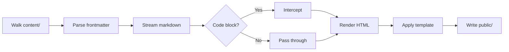
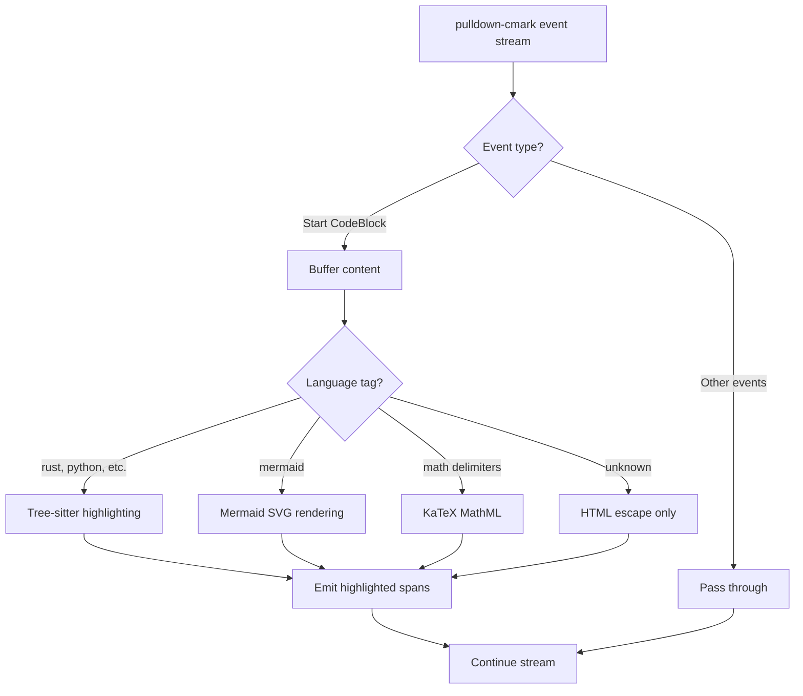

Sukr is a 13-module static site compiler. Every feature that would typically require client-side JavaScript is moved to build-time.

## Pipeline Overview



## Module Responsibilities

| Module               | Purpose                                             |
| :------------------- | :-------------------------------------------------- |
| `main.rs`            | Pipeline orchestrator — wires everything together   |
| `config.rs`          | Loads `site.toml` configuration                     |
| `content.rs`         | Discovers sections, pages, and navigation structure |
| `render.rs`          | Markdown→HTML with code block interception          |
| `highlight.rs`       | Tree-sitter syntax highlighting (14 languages)      |
| `math.rs`            | KaTeX rendering to MathML                           |
| `mermaid.rs`         | Mermaid diagrams to inline SVG                      |
| `css.rs`             | CSS minification via lightningcss                   |
| `template_engine.rs` | Tera template loading and rendering                 |
| `feed.rs`            | Atom feed generation                                |
| `sitemap.rs`         | XML sitemap generation                              |
| `escape.rs`          | HTML/XML text escaping utilities                    |
| `error.rs`           | Structured error types with source chaining         |

## The Interception Pattern

The core innovation is **event-based interception**. Rather than parsing markdown into an AST and walking it twice, sukr streams `pulldown-cmark` events and intercepts specific patterns:



This pattern avoids buffering the entire document. Each code block is processed in isolation as it streams through.

## Why Zero-JS

Traditional SSGs ship JavaScript for:

| Feature             | Typical Approach       | Sukr Approach                                     |
| :------------------ | :--------------------- | :------------------------------------------------ |
| Syntax highlighting | Prism.js, Highlight.js | Tree-sitter at build-time → `<span class="hl-*">` |
| Math rendering      | MathJax, KaTeX.js      | KaTeX at build-time → MathML (browser-native)     |
| Diagrams            | Mermaid.js             | mermaid-rs at build-time → inline SVG             |
| Mobile nav          | JavaScript toggle      | CSS `:has()` + checkbox hack                      |

The result: **zero bytes of JavaScript** in the output. Pages load instantly, work without JS enabled, and avoid the complexity of client-side hydration.

## Static Configuration Pattern

Tree-sitter grammars are expensive to initialize. Sukr uses [tree-house](https://github.com/helix-editor/tree-house) (Helix editor's Tree-sitter integration) with `LazyLock` to create language configurations exactly once:

```rust
/// Create a LanguageConfig for a language with embedded queries.
fn make_config(
    grammar: Grammar,
    highlights: &str,
    injections: &str,
    locals: &str,
) -> Option<LanguageConfig> {
    LanguageConfig::new(grammar, highlights, injections, locals).ok()
}

// Register Rust with embedded Helix queries
if let Ok(grammar) = Grammar::try_from(tree_sitter_rust::LANGUAGE)
    && let Some(config) = make_config(
        grammar,
        include_str!("../queries/rust/highlights.scm"),
        include_str!("../queries/rust/injections.scm"),
        include_str!("../queries/rust/locals.scm"),
    )
{
    config.configure(resolve_scope);
    configs.insert(Language::Rust, config);
}
```

This pattern ensures O(1) lookup per language regardless of how many code blocks exist in the site.

## Single-Pass Content Discovery

The `SiteManifest` struct aggregates all content in one filesystem traversal:

- Homepage (`_index.md` at root)
- Sections (directories with `_index.md`)
- Section items (posts, projects, pages)
- Navigation tree (derived from structure + frontmatter weights)

This avoids repeated directory scans during template rendering.

## Implementation Notes

Sukr prioritizes **output quality** over minimal build-time footprint. Current dependency choices reflect this:

| Feature  | Library    | Trade-off                                                                |
| :------- | :--------- | :----------------------------------------------------------------------- |
| Math     | KaTeX      | Full LaTeX coverage; heavier than minimal alternatives like latex2mathml |
| Diagrams | mermaid-rs | High-fidelity SVG; uses headless rendering under the hood                |

Lighter alternatives exist and may be evaluated as they mature. The goal is browser-native output with zero client-side JavaScript—build-time weight is a secondary concern.
