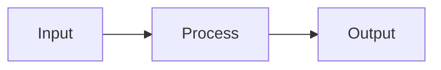
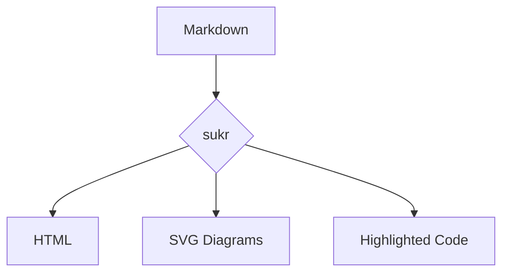

# Mermaid Diagrams

sukr renders Mermaid diagrams at build time, producing inline SVG. No client-side JavaScript required.

## Usage

Use fenced code blocks with `mermaid` language:

````markdown

````

## Supported Diagram Types

| Type      | Status          | Description                               |
| --------- | --------------- | ----------------------------------------- |
| Flowchart | ✅ Full support | Flow diagrams with nodes and edges        |
| Graph     | ✅ Full support | Directed/undirected graphs                |
| Sequence  | ⚠️ Partial      | Sequence diagrams (some layouts may vary) |
| State     | ⚠️ Partial      | State machine diagrams                    |
| Class     | ⚠️ Partial      | UML class diagrams                        |

> **Note:** Some complex diagram types may have layout differences compared to the JavaScript renderer. Flowcharts and basic graphs work reliably.

## How It Works

1. During Markdown parsing, `mermaid` code blocks are intercepted
2. The Mermaid definition is parsed and rendered to SVG
3. The SVG is inlined directly in the HTML output
4. No JavaScript or external resources needed

## Example



## Styling

Mermaid SVGs inherit your CSS variables. Customize the look by targeting SVG elements:

```css
.mermaid svg {
  max-width: 100%;
  height: auto;
}

.mermaid .node rect {
  fill: var(--bg-sidebar);
  stroke: var(--accent);
}
```

## Fallback

If a diagram fails to render (complex diagrams, syntax errors), the original code block is preserved with an error comment.
